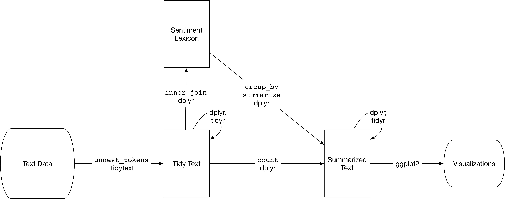

# 用 tidy 数据进行情感分析 {#sentiment}

```{r echo = FALSE}
library(knitr)
opts_chunk$set(message = FALSE, warning = FALSE, cache = TRUE)
options(width = 100, dplyr.width = 100)
library(jiebaR)
library(showtext)
showtext_auto(enable = TRUE)
pdf()
library(ggplot2)
theme_set(theme_light())
```

前一章中，我们深入探索了何为 tidy 文本格式，并展示了如何在关于词频的问题中应用这一格式。我们可以分析文档中哪些词使用频率最高。现在我们来调查一个不同的主题，对倾向进行挖掘，即情感分析。当人类读者接触到一个文本，会对情感意图词汇进行推断，理解一段文本是正面还是负面的，或者归类于其它更细微的情感，如惊讶或恶心。我们可以用文本挖掘工具程序化地获得文本的情感内容，如图 \@ref(fig:tidyflow-ch2) 所示。

```{r tidyflow-ch2, echo = FALSE, out.width = '100%', fig.cap = "典型的使用 tidy 文本进行情感分析的文本分析流程图"}

```

分析文本的情感有一种方式是把文本看作独立的词的组合，而把整个文本的情感内容看作独立的词的情感内容之和。这不是情感分析的唯一途径，但是一种常用的方法，*而且*是利用 tidy 工具生态系统优势很自然的一种方法。

## `sentiments` 数据集

如上所述，有多种方法和字典可以评估文本的倾向或情感。tidytext 包在其 `sentiments` 数据集中包含了几个情感字典。

```{r}
library(tidytext)

sentiments
```

这三个通用性质的词典为：

* `AFINN` 来自 [Finn Årup Nielsen](http://www2.imm.dtu.dk/pubdb/views/publication_details.php?id=6010)
* `bing` 来自 [Bing Liu and collaborators](https://www.cs.uic.edu/~liub/FBS/sentiment-analysis.html)
* `nrc` 来自 [Saif Mohammad and Peter Turney](http://saifmohammad.com/WebPages/NRC-Emotion-Lexicon.htm)

这三个词典全部基于一元组，即单独的词。这些词典包含了很多英语词，每个词都有正面/负面情感的分数，以及可能的情感类型如开心、愤怒、悲伤等。`nrc` 词典把词按二元（是/否）标注在各个类别中，如正面、负面、愤怒、期待、恶心、恐惧、开心、悲伤、惊讶和信任。`bing` 词典把词按二元归于正面和负面的类别。`AFINN` 词典给每个词分配 -5 到 5 之间的值，负值代表负面情感，正值代表正面情感。这些信息列在 `sentiments` 数据集的表格中，tidytext 提供了 `get_sentiments()` 函数以获取特定的情感词典，且不含其未使用的列。

```{r, eval=FALSE}
get_sentiments("afinn")
get_sentiments("bing")
get_sentiments("nrc")
```

这些情感词典是怎么制作和校验的呢？要么使用众包（比如 Amazon Mechanical Turk）创建，要么是由作者创建，然后再用众包的组合进行校验，来自餐馆或电影的评价或 Twitter 数据。得到这个信息后，我们可能不愿把这些情感词典用在风格与校验文本相当不同的文本上，比如几百年前的叙事小说。然而，尽管把这些文本用在曹雪芹的小说上可能会得到整体上较不准确的结果，我们仍然可以评估文本与词典中相同的词的情感信息。

也有一些领域相关的情感词典，使用特别的内容范畴的文本创建。节 \@ref(financial) 探索使用金融相关情感词典进行分析。

```{block, type = "rmdnote"}
Dictionary-based methods like the ones we are discussing find the total sentiment of a piece of text by adding up the individual sentiment scores for each word in the text.
```

词典并不包含全部英语词，因为很多英语词相当中性。要记住很重要的一点，这些方法没有考虑对词的修饰，如“不对”“不真实”等；基于词典的方法只基于一元组。对于很多种类的文本而言（如下面的叙事性文本示例），没有大段的讽刺或否定性描写，所以影响倒也不十分明显。而且，我们可以使用 tidy 文本的方法去了解哪些否定词在给定文本中比较重要；对此分析进行扩展的示例见章 \@ref(usenet)。

最后的一点提醒是用来加和情感分数的文本大小会对分析结果造成影响。过多段落经常会由于正面和负面情感互相抵消导致平均值接近0，句子或者段落通常更合适。

## 使用内部联接进行情感分析

使用 tidy 格式的数据，可以用内部联接的方式完成情感分析。这是将文本挖掘视为 tidy 数据分析任务的又一伟大胜利；就和移除停止词是一个反向联接操作一样，执行情感分析是一个内部联接操作。

我们看看来自NRC词典的含有开心成分的词。在《红楼梦》英译本中，最常见的表示开心的词有哪些？首先，我们从小说中得到文本，然后用 `unnest_tokens()` 把文本转换为 tidy 格式，如同像在节 \@ref(tidyworks) 中所做的。同时也建立一些其它的列来保存每个词来自哪个章回的哪行之类的信息；我们用 `group_by` 和 `mutate` 来创建这些列。

```{r eval = FALSE}
library(gutenbergr)

hongloumeng_en <- gutenberg_download(c(9603, 9604), meta_fields = "title")
```

```{r hongloumeng_en_sentiment, echo = FALSE}
load("data/hongloumeng_en.rda")
```

```{r tidy_books_sentiment, dependson = "hongloumeng_en_sentiment"}
library(dplyr)
library(stringr)

tidy_books <- hongloumeng_en %>%
  mutate(book = cumsum(str_detect(text, regex("HUNG LOU MENG, BOOK [I]+")))) %>%
  group_by(book) %>%
  mutate(linenumber = row_number(),
         chapter = cumsum(str_detect(text, regex("^chapter [\\divxlc].", 
                                                 ignore_case = TRUE)))) %>%
  ungroup() %>%
  unnest_tokens(word, text)
```

注意，我们选择 `word` 作为来自 `unnest_tokens()` 的输出列名。这个选择是为了方便，因为情感词典和停止词数据集都用列名 `word`；执行内部联接和反向联接会更容易。

现在文本已经是 tidy 格式，每行一个词，我们可以开始情感分析。首先，使用 NRC 词典和 `filter()` 得到开心的词。之后，用 `filter()` 得到上半部书的词，然后用 `inner_join()` 执行情感分析。上半部书里最常见表示开心的词有哪些？使用 dplyr 里的 `count()`。

```{r eval=FALSE}
nrc <- get_sentiments("nrc")
```

```{r echo=FALSE}
load("data/nrc.rda")
nrc
```

```{r nrcjoy, dependson = "tidy_books_sentiment"}
nrc_joy <- nrc %>% 
  filter(sentiment == "joy")

tidy_books %>%
  filter(book == "1") %>%
  inner_join(nrc_joy) %>%
  count(word, sort = TRUE)
```

可以看到多数正面的词如 young、good 和 smile 等。也可以看到一些可能不是用于开心含义的词如 found 和 present；我们将在节 \@ref(most-positive-negative) 中讨论更多细节。

我们也可以查看情感在整部小说中如何变化，只用主要来自 dplyr 的几行函数。首先，用 Bing 词典和 `inner_join()` 找到每个词的情感得分。然后，计算每个部分中正面和负面词的数量。我们定义一个 `index` 来记录叙事的进程；这个索引（使用整数除法）按每100行文本进行累加。

```{block, type = "rmdtip"}
The `%/%` operator does integer division (`x %/% y` is equivalent to `floor(x/y)`) so the index keeps track of which 80-line section of text we are counting up negative and positive sentiment in. 
```

过小的文本段落可能没有足够的词以得到较好的情感估值，而过大的段落会打破叙事结构。对本书而言，100-200行看起来比较合适，不同文本可能适用不同的行数。之后可以用 `spread()` 在不同的列中分别得到负面和正面情感，最后计算情感净值（正面计数 - 负面计数）。

```{r net_sentiment, dependson = "tidy_books_sentiment"}
library(tidyr)

net_sentiment <- tidy_books %>%
  inner_join(get_sentiments("bing")) %>%
  count(book, index = linenumber %/% 100, sentiment) %>%
  spread(sentiment, n, fill = 0) %>%
  mutate(sentiment = positive - negative)
```

现在可以为上下半部分别绘制情感分值图。注意，横轴为记录叙事文本时值的索引。

```{r sentimentplot, dependson = "net_sentiment", fig.width=9, fig.height=10, fig.cap="《红楼梦》英译本叙事过程中的情感"}
library(ggplot2)

ggplot(net_sentiment, aes(index, sentiment, fill = book)) +
  geom_col(show.legend = FALSE) +
  facet_wrap(~book, ncol = 2, scales = "free_x")
```

在图 \@ref(fig:sentimentplot) 中可以看到情感随着故事的进展是如何变化的。

## 对三个情感字典进行比较

既然情感词典有几个选择，你可能想要得到更多信息，哪个词典更适合你的用途。我们在《红楼梦》英译本的下半部分使用全部的三个情感词典，查看情感如何变化。首先，使用 `filter()` 选出我们要用到的书里的词。

```{r book_2, dependson = "tidy_books_sentiment"}
book_2 <- tidy_books %>% 
  filter(book == "2")

book_2
```

现在使用 `inner_join()` 用不同的方法计算情感。

```{block, type = "rmdnote"}
Remember from above that the AFINN lexicon measures sentiment with a numeric score between -5 and 5, while the other two lexicons categorize words in a binary fashion, either positive or negative. To find a sentiment score in chunks of text throughout the novel, we will need to use a different pattern for the AFINN lexicon than for the other two. 
```

依然使用整数除法（`%/%`）确定含有多行的较大段的文本，用同样的方式使用 `count()`、`spread()`和`mutate()` 算出每段文本的情感净值。

```{r eval=FALSE}
get_sentiments("afinn")
```

```{r echo=FALSE}
load("data/afinn.rda")
afinn
```

```{r comparesentiment, dependson = "book_2"}
afinn <- book_2 %>% 
  inner_join(afinn) %>%
  group_by(index = linenumber %/% 100) %>% 
  summarise(sentiment = sum(value)) %>%
  mutate(method = "AFINN")

bing_and_nrc <- bind_rows(book_2 %>% 
                            inner_join(get_sentiments("bing")) %>%
                            mutate(method = "Bing et al."),
                          book_2 %>% 
                            inner_join(nrc %>%
                                         filter(sentiment %in% c("positive", 
                                                                 "negative"))) %>%
                            mutate(method = "NRC")) %>%
  count(method, index = linenumber %/% 100, sentiment) %>%
  spread(sentiment, n, fill = 0) %>%
  mutate(sentiment = positive - negative)
```

现在有了每个情感词典对小说文本中每段的情感净值的估值（正面计数 - 负面计数）。在图 \@ref(fig:compareplot) 中可以看到全部的结果。

(ref:comparecap) 用《红楼梦》英译本下半部比较三个情感词典

```{r compareplot, dependson = "comparesentiment", fig.width=9, fig.height=7.5, fig.cap="(ref:comparecap)"}
bind_rows(afinn, 
          bing_and_nrc) %>%
  ggplot(aes(index, sentiment, fill = method)) +
  geom_col(show.legend = FALSE) +
  facet_wrap(~method, ncol = 1, scales = "free_y")
```

用来计算情感的三个不同的词典给出的结果有所不同，但随着整个小说的进展的变化相似。我们在小说的相同位置能看到相似的峰和谷，但绝对值很不一样。AFINN 词典给出的绝对值最高，达到了最大正值和最小负值。来自 Bing 词典的绝对值较低。与另两个词典相比，NRC 的结果偏高，对文本的标注偏向正面，但相对而言依然检测到了类似的文本变化趋势。我们发现这几个词典在不同的小说中有相似的表现；NRC 情感值偏高，AFINN 情感值变化较丰富，Bing 有时候会找到更长的连续情感文本，但基本上全部三个词典在同一个叙事路径上会得到一致的趋势。

为什么，比如说，NRC 词典的结果在情感上的倾向相比起来如此之高？我们粗略看看这些词典中正面与负面的词数。

```{r}
get_sentiments("nrc") %>% 
     filter(sentiment %in% c("positive", 
                             "negative")) %>% 
  count(sentiment)

get_sentiments("bing") %>% 
  count(sentiment)
```

两个词典都是负面词更多，但负面与正面之比 Bing 词典要高于 NRC 词典。这对我们在图 \@ref(fig:compareplot) 中看到的现象有所贡献，也可能有词匹配的系统性的不同，如 NRC 词典中的负面词可能与小说中使用的不甚吻合。无论这些不同来自何处，我们都在整个叙事路径上看到了相似的进展，相似的坡度，但词典间会标记不同的绝对值。在为分析选择情感词典时需要考虑这些重要的区别。

## 最常见的正面词和负面词 {#most-positive-negative}

使用同时包含情感和词的数据框的优势在于我们可以分析对每种情感有贡献的词的计数。通过同时使用 `word` 和 `sentiment` 为参数实现 `count()`，我们可以发现每个词对每个情感贡献多大。

```{r wordcounts, dependson = "tidy_books_sentiment"}
bing_word_counts <- tidy_books %>%
  inner_join(get_sentiments("bing")) %>%
  count(word, sentiment, sort = TRUE) %>%
  ungroup()

bing_word_counts
```

我们可以直接通过管道发送到 ggplot2 进行可视化，因为我们一直坚持使用处理 tidy 数据框的工具。

```{r pipetoplot, dependson = "wordcounts", fig.width=8, fig.height=4, fig.cap="《红楼梦》英译本中正面和负面情感的词"}
bing_word_counts %>%
  group_by(sentiment) %>%
  top_n(10) %>%
  ungroup() %>%
  mutate(word = reorder(word, n)) %>%
  ggplot(aes(word, n, fill = sentiment)) +
  geom_col(show.legend = FALSE) +
  facet_wrap(~sentiment, scales = "free_y") +
  labs(y = "Contribution to sentiment",
       x = NULL) +
  coord_flip()
```

图 \@ref(fig:pipetoplot) 让我们发现情感分析中的一个异常；词 miss 被记成负面，但在作品中多数时候是指年轻未婚的女士。如果这不符合我们的目的，我们可以用 `bind_rows()` 把这样的词加进自定义停止词列表。我们可以很方便地像这样应用各种策略。

```{r custom_stop_words, dependson = "wordcounts"}
custom_stop_words <- bind_rows(data_frame(word = c("miss", "hung", "well", "master"),
                                          lexicon = c("custom")),
                               stop_words)
custom_stop_words
```

## 词云

我们已经看到这个 tidy 文本挖掘方法用 ggplot2 绘图很简单，不仅如此，tidy 格式的数据用其它绘图方法也很方便。

比如，考虑使用 wordcloud2 包 [@R-wordcloud2] 以便显示中文。我们再来看一下《红楼梦》中最常见的词，但这次是词云图 \@ref(fig:firstwordcloud)。

```{r firstwordcloud, fig.height=6, fig.width=6, fig.cap="《红楼梦》常见词云"}
library(wordcloud2)
load("data/hongloumeng.rda")

# 不保留标点符号；移除停止词
cutter <- worker(bylines = TRUE, stop_word = "data/stop_word_zh.utf8")
hongloumeng %>%
  mutate(text = sapply(segment(text, cutter), function(x){paste(x, collapse = " ")})) %>%
  unnest_tokens(word, text) %>%
  count(word) %>%
  top_n(80) %>%
  wordcloud2(fontFamily = "wqy-microhei")
```

使用 R base 的 wordcloud 包 [@R-wordcloud] 包含了 `comparison.cloud()`，可以用 reshape2 的 `acast()` 把数据框转变为矩阵。用内部联接标记情感分析正面和负面的词，然后找到最常见的正面和负面词。在把数据发给 `comparison.cloud()` 之前，都可以用联接、管道和 dplyr，因为数据为 tidy 格式。

```{r wordcloud, dependson = "custom_stop_words", fig.height=5, fig.width=5, fig.cap="《红楼梦》英译本中最常见的正面与负面词"}
library(reshape2)
library(wordcloud)

tidy_books %>%
  inner_join(get_sentiments("bing")) %>%
  anti_join(custom_stop_words) %>%
  count(word, sentiment, sort = TRUE) %>%
  acast(word ~ sentiment, value.var = "n", fill = 0) %>%
  comparison.cloud(colors = c("gray20", "gray80"),
                   max.words = 80)
```

图 \@ref(fig:wordcloud) 中词的大小与其在其情感中的出现频次成正比。我们可以从这个可视化中看出最重要的正面与负面的词，但要注意不同情感间词的大小不能直接比较。

## 查看词以上的单元

很多有意义的工作可以通过在词的层次上符号化完成，但有时候需要甚至必须观察不同的文本单元。例如，有些情感分析算法关注超出一元组（即单个词）的单元，尝试在整句范围内理解情感。这些算法尝试判断

> 我今天不开心。

属于悲伤，而非高兴，因为有否定词的存在。R 包如 coreNLP [@R-coreNLP]、cleanNLP [@R-cleanNLP] 和 sentimentr [@R-sentimentr] 都属于这种情感分析算法。为此，我们需要把文本按句符号化，于是也需要为输出列取个新的名字。

```{r hongloumeng_en_sentences}
hongloumeng_en_sentences <- data_frame(text = hongloumeng_en$text) %>%
  unnest_tokens(sentence, text, token = "sentences")
hongloumeng_en_sentences$sentence[20]
```

按句进行符号化在 UTF-8 文本上可能会有问题，把标点符号处理为 ASCII 较好。如果需要的话，可以尝试使用 `iconv()`，如加入进行 `iconv(text, to = 'latin1')` 的 `mutate`。

`unnest_tokens()` 的另一个选择是使用正则表达式。比如，按章回把文本切分为数据框。

```{r hongloumeng_en_chapters, dependson = "tidy_books_sentiment"}
hongloumeng_en_chapters <- hongloumeng_en %>%
  mutate(book = cumsum(str_detect(text, regex("HUNG LOU MENG, BOOK [I]+")))) %>%
  group_by(book) %>%
  unnest_tokens(chapter, text, token = "regex", 
                pattern = "CHAPTER [\\dIVXLC].") %>%
  ungroup()

hongloumeng_en_chapters %>% 
  group_by(book) %>% 
  summarise(chapters = n())
```

现在我们得到了全部章节（以及“额外”的一行代表属于哪本书）。在 `hongloumeng_en_chapters` 数据框中，每行代表一章。

在本章开始处，我们用类似的正则表达式在小说中找出了全部章回，每行一个词的 tidy 数据框。我们可以用 tidy 文本分析回答问题如何为最负面的章回。首先，从 Bing 词典中得到全部负面词。其次，为每章制作一个词数的数据框，以便把章节长度均一化。之后，找到每章中负面词的个数，并除以该章的词数。对于上下半部，哪些章负面词的比例最高？

```{r chapters, dependson = "tidy_books_sentiment"}
bingnegative <- get_sentiments("bing") %>% 
  filter(sentiment == "negative")

wordcounts <- tidy_books %>%
  group_by(book, chapter) %>%
  summarize(words = n())

tidy_books %>%
  semi_join(bingnegative) %>%
  group_by(book, chapter) %>%
  summarize(negativewords = n()) %>%
  left_join(wordcounts, by = c("book", "chapter")) %>%
  mutate(ratio = negativewords/words) %>%
  filter(chapter != 0) %>%
  top_n(3) %>%
  ungroup()
```

这些是含有最多负面词的章回，按章的词数进行了均一化。这些章中发生了什么？第2卷第21章对应第四十四回《变生不测凤姐泼醋 喜出望外平儿理妆》。凤姐发现贾琏偷情，进门撕打叫骂，贾琏提剑欲杀凤姐，后鲍二家的上吊自尽，其间穿插宝玉为平儿黛玉伤感，确实全篇较低沉。需要说明的是此《红楼梦》英译本未包含悲剧性的结尾。

## 小结

情感分析提供了理解文本表现的态度和倾向的一种方法。本章中，我们探索了如何使用 tidy 数据原则进行情感分析；文本数据为 tidy 数据结构时，情感分析可以通过内部联接实现。我们可以用情感分析理解叙事路径如何随着情节开展发生变化，以及哪些带有情绪与倾向内容的词对于特定文本比较重要。我们将继续开发我们的工具箱，在本书后面的例子中我们将把情感分析应用于不同种类的文本。
